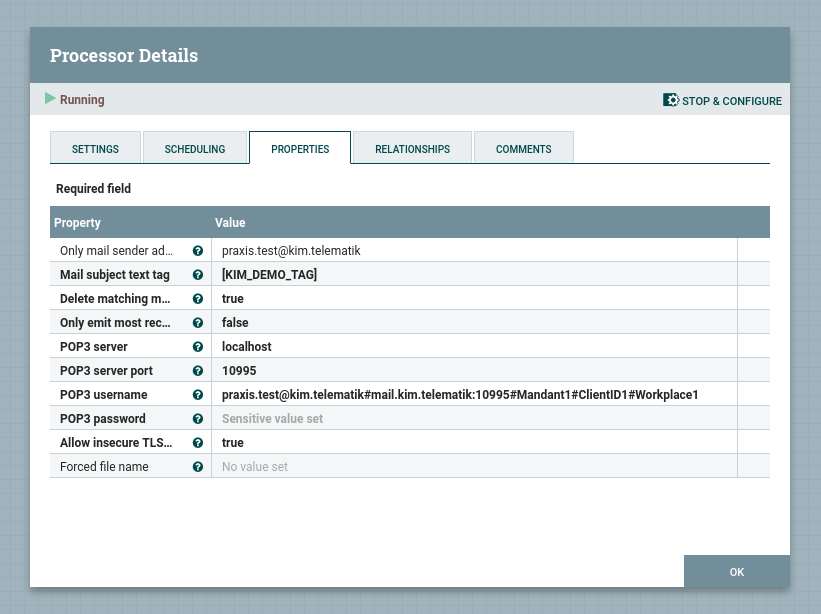

# KIM Care

KIM Care is a toolset to transfer files via the KIM component of the German Telematik-Infrastruktur using Apache NiFi.\
The Apache NiFI processors were tested with [KoPS 3.1](https://fachportal.gematik.de/toolkit/kops).

## NiFI Usage

Prerequisites:
- A local/remote NiFI service of a certain version is assummed.
- Maven should be installed locally to compile the processors.

### Compile Processors
Compile the processors with the following steps:
- Change both NiFi version entries in `nifi-kim-*/pom.xml` from `1.18.0` to your NiFi version.
- Run the following commands:
```bash
# Transceiver
cd uaux-kim-tx
mvn clean package
cd ..

# Receiver
cd uaux-kim-rx
mvn clean package
cd ..
```
- Retrieve the `.nar` processor files from `uaux-kim-*/nifi-kim-*-nar/target/nifi-kim-*-nar-*.nar` and place them into the lib folder of the NiFi instance.
- Restart the NiFi instance to load the processors.

### Deploy Processors
**Note**: If you are using the KoPS simulator, make sure to virtually insert a valid crypto card to be able to successfully authenticate with SMTP/POP3.

**Transmission**: The KIMTX processor sends an incoming flow file to a KIM address as mail with attachment. Change the flow file `filename` attribute to define the file name of the attachment.\
An example is given here:\
<kbd></kbd>

The configuration can be as follows:\
<kbd></kbd>


**Receive**: The KIMRX processor emits a flow file with the content of a received mail attachment.
An example is given here:\
<kbd></kbd>

The configuration can be as follows:\
<kbd></kbd>
